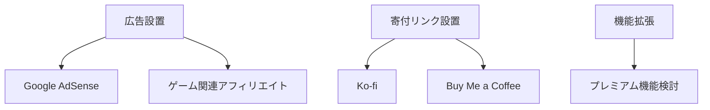

# Claude MAXプラン代金を稼ぐための収益化戦略

## 前提条件

- **Claude MAXプラン料金**: 月額約$100〜$200（日本円で約15,000円〜30,000円）
- **目標**: 月額15,000円〜30,000円の収益をClaudeを使って生成する

---

## 1. 現在のプロジェクト分析

### OnceWorld Tools プロジェクト概要
- **ジャンル**: ゲーム攻略ツール（OnceWorldというゲームの計算ツール）
- **技術スタック**: React + TypeScript + Vite + Tailwind CSS
- **現在の機能**:
  - 被ダメ無効ライン計算機
  - モンスタープリセット選択
  - ダメージ計算
  - Wikiスクレイピング機能
- **データ**: モンスター、装備、アクセサリー、魔法などのJSONデータ

### 収益化可能性
- **対象ユーザー**: OnceWorldゲームプレイヤー（ニッチな層）
- **広告収入**: 小規模だが可能
- **ドネーション**: 熱心なユーザーからの寄付
- **プレミアム機能**: 追加計算機能など

---

## 2. 収益化モデル候補

### A. 既存プロジェクトの拡張・収益化

#### A-1. OnceWorld Toolsの収益化
```
収益源:
├── Google AdSense（月額 1,000円〜5,000円想定）
├── 寄付リンク（Ko-fi, Buy Me a Coffee）
├── プレミアム機能（月額 300円〜500円）
│   ├── 詳細なダメージシミュレーション
│   ├── 装備最適化機能
│   └── パーティーシミュレーター
└── アフィリエイト（ゲーム関連商品）
```

**利点**: 既に構築済み、すぐに実装可能
**欠点**: ユーザー層が限定的、収益規模が小さい

#### A-2. ゲーム攻略ツールの多言語化・拡張
- 他の人気ゲーム向けツールの開発
- 英語対応でグローバル展開

---

### B. 新規プロジェクトの開発

#### B-1. SaaS型ツール開発
Claudeを活用して迅速に開発できるSaaSアイデア:

| プロジェクト | 概要 | 想定収益モデル | 難易度 |
|------------|------|---------------|--------|
| **SEOブログ生成ツール** | AI支援記事作成・管理 | 月額課金 | 中 |
| **コードレビュー支援ツール** | AIコード分析・改善提案 | 月額課金 | 高 |
| **画像生成・編集ツール** | AI画像加工・バナー作成 | 従量課金 | 中 |
| **データ可視化ダッシュボード** | CSV→グラフ自動生成 | フリーミアム | 低 |
| **翻訳支援ツール** | 専門用語対応翻訳 | 月額課金 | 低 |

#### B-2. コンテンツビジネス
```
Claude活用コンテンツ作成:
├── 技術ブログ運営
│   ├── プログラミングチュートリアル
│   ├── AI活用事例
│   └── ゲーム開発日記
├── YouTube動画スクリプト作成
├── 電子書籍作成
│   └── 「Claudeで始めるWeb開発」など
└── ニュースレター配信
```

#### B-3. フリーランス・受託開発
```
Claudeを活用した効率化:
├── Webサイト開発（5万円〜30万円/件）
├── 業務自動化ツール開発
├── データ分析レポート作成
└── 技術コンサルティング
```

---

### C. 自動化・受動的収入モデル

#### C-1. アフィリエイト型サイト
```
自動生成コンテンツ:
├── 製品レビューサイト
├── 比較サイト
├── まとめ記事サイト
└── ニッチなFAQサイト
```

#### C-2. デジタルプロダクト販売
```
販売可能なデジタル商品:
├── Notionテンプレート
├── スプレッドシートテンプレート
├── 自動化スクリプト
├── プログラミング学習教材
└── AIプロンプト集
```

---

## 3. 推奨戦略（優先順位付き）

### Phase 1: 即座に収益化（1〜2ヶ月）

#### 1. OnceWorld Toolsの収益化強化


**期待収益**: 月額 2,000円〜10,000円

#### 2. 技術ブログの開始
- **プラットフォーム**: Zenn, Qiita, 個人ブログ
- **コンテンツ**: 
  - OnceWorld Toolsの開発記録
  - React/TypeScript Tips
  - Claude活用事例
- **収益化**: バッジ、スポンサー、広告

**期待収益**: 月額 1,000円〜5,000円

---

### Phase 2: スケールアップ（3〜6ヶ月）

#### 3. 汎用ゲームツールの開発
OnceWorld Toolsの技術を応用:
- ダメージ計算機ジェネレーター
- ゲームデータベーステンプレート
- 複数ゲーム対応の計算ツール

**期待収益**: 月額 5,000円〜20,000円

#### 4. SaaSプロトタイプ開発
Claudeを最大限活用した開発:
- **アイデア**: ゲーム開発者向けデータ管理ツール
- **技術**: React + Firebase + Claude API
- **収益モデル**: フリーミアム

**期待収益**: 月額 10,000円〜50,000円（成長後）

---

### Phase 3: 安定的収入（6ヶ月〜）

#### 5. 複数収益源の組み合わせ
```
目標: 月額 30,000円

内訳:
├── SaaS月額課金: 15,000円
├── 広告・アフィリエイト: 5,000円
├── デジタル商品販売: 5,000円
├── 寄付・スポンサー: 3,000円
└── 受託開発: 2,000円（継続的）
```

---

## 4. 具体的なアクションプラン

### 今週やること
1. [ ] Google AdSense申請
2. [ ] Ko-fi/Buy Me a Coffeeアカウント作成
3. [ ] Zennアカウント作成・初記事投稿
4. [ ] OnceWorldコミュニティでの宣伝

### 今月やること
1. [ ] プレミアム機能の設計
2. [ ] 技術ブログ週1投稿
3. [ ] Twitter/Xでの情報発信開始
4. [ ] 次のツールアイデアの選定

### 3ヶ月以内
1. [ ] 新規ツールのリリース
2. [ ] SaaSプロトタイプ開発
3. [ ] メルマガ読者100人達成
4. [ ] 月収10,000円達成

---

## 5. Claudeの効果的活用法

### 開発効率化
```
Claude活用シーン:
├── コード生成・レビュー
├── ドキュメント作成
├── デバッグ支援
├── UI/UX提案
└── テストケース生成
```

### コンテンツ作成
```
Claude活用シーン:
├── ブログ記事構成案
├── 技術解説のドラフト
├── SNS投稿案
├── ドキュメント翻訳
└── マーケティングコピー
```

---

## 6. リスクと対策

| リスク | 対策 |
|--------|------|
| 収益が見込みより低い | 複数の収益源を並行して構築 |
| 競合の出現 | ニッチ特化と継続的な改善 |
| Claude依存 | スキル向上と他ツールも活用 |
| 時間不足 | 自動化と優先順位付け |

---

## まとめ

**最も現実的なアプローチ**:
1. **即座に**: OnceWorld Toolsに広告・寄付リンクを設置
2. **短期間**: 技術ブログで収益化
3. **中期的**: 新しいSaaSツールを開発
4. **長期的**: 複数の収益源を組み合わせて安定化

**Claudeへの投資回収**は、継続的な活用と複数の収益化チャネル構築により、3〜6ヶ月で達成可能です。
