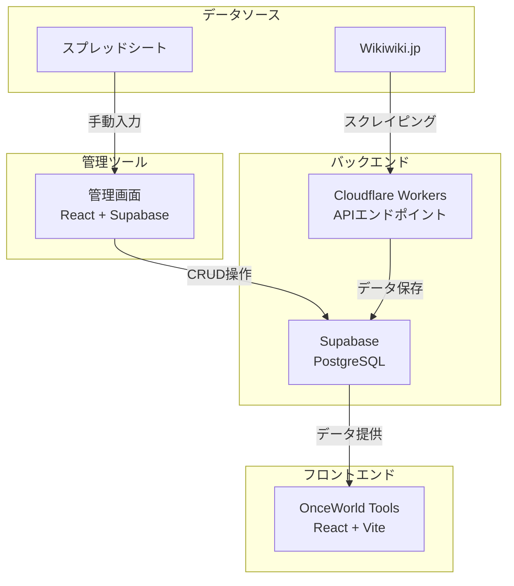
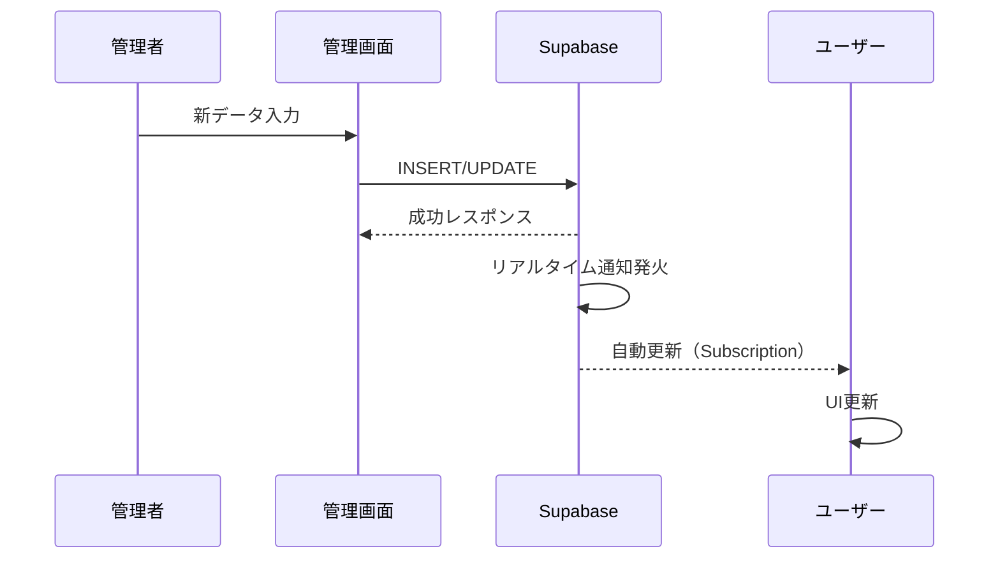
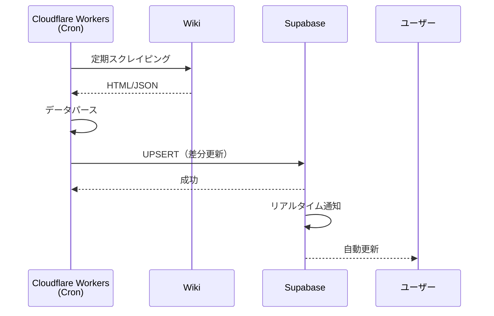

# OnceWorld Tools データ管理アーキテクチャ設計

## 現状の課題

- Wikiやスプレッドシートからデータをコピペしている
- アップデート時のメンテナンスが面倒
- データの一元管理ができていない
- 複数のデータソース（JSONファイル、TypeScriptファイル）が混在

---

## 推奨アーキテクチャ

### オプション比較

| オプション | コスト | 運用負荷 | リアルタイム性 | おすすめ度 |
|-----------|--------|---------|--------------|-----------|
| **A. Supabase** | 無料〜低 | 低 | ◎ | ★★★★★ |
| **B. Firebase** | 無料〜低 | 低 | ◎ | ★★★★☆ |
| **C. SQLite + サーバー** | 無料 | 中 | ◎ | ★★★☆☆ |
| **D. JSONファイル（現状維持+改善）** | 無料 | 高 | △ | ★★☆☆☆ |

---

## 推奨: Option A - Supabase

### なぜSupabaseか？

1. **無料枠が充実**（500MB DB, 1GB帯域）
2. **PostgreSQLベース**で信頼性高い
3. **リアルタイム更新**が簡単
4. **認証機能**も内蔵（将来的なユーザー機能に対応）
5. **TypeScriptサポート**が充実
6. **ローカル開発環境**も用意できる

### アーキテクチャ図



---

## データベース設計

### テーブル構成

```sql
-- モンスター
CREATE TABLE monsters (
    id SERIAL PRIMARY KEY,
    name VARCHAR(100) NOT NULL,
    level INTEGER,
    atk INTEGER,
    int INTEGER,
    attack_type VARCHAR(10) CHECK (attack_type IN ('物理', '魔法')),
    required_def INTEGER,
    required_mdef INTEGER,
    location TEXT,
    capture_rate VARCHAR(20),
    created_at TIMESTAMP DEFAULT NOW(),
    updated_at TIMESTAMP DEFAULT NOW()
);

-- アイテム
CREATE TABLE items (
    id SERIAL PRIMARY KEY,
    name VARCHAR(100) NOT NULL,
    category VARCHAR(50), -- 武器, 防具, アクセサリー, 素材, etc
    type VARCHAR(50), -- 剣, 杖, 鎧, etc
    atk INTEGER,
    def INTEGER,
    m_def INTEGER,
    int INTEGER,
    hp INTEGER,
    mp INTEGER,
    effects JSONB, -- 特殊効果をJSONで保存
    drop_from TEXT[], -- ドロップ元モンスターID配列
    created_at TIMESTAMP DEFAULT NOW(),
    updated_at TIMESTAMP DEFAULT NOW()
);

-- 装備
CREATE TABLE equipments (
    id SERIAL PRIMARY KEY,
    name VARCHAR(100) NOT NULL,
    slot VARCHAR(20), -- 武器, 頭, 体, 手, 足, アクセサリー
    rarity VARCHAR(20), -- 通常, レア, 激レア, etc
    base_atk INTEGER,
    base_def INTEGER,
    base_m_def INTEGER,
    base_int INTEGER,
    base_hp INTEGER,
    base_mp INTEGER,
    upgrade_bonus JSONB, -- 強化時のボーナス
    created_at TIMESTAMP DEFAULT NOW(),
    updated_at TIMESTAMP DEFAULT NOW()
);

-- 魔法
CREATE TABLE magics (
    id SERIAL PRIMARY KEY,
    name VARCHAR(100) NOT NULL,
    element VARCHAR(20), -- 火, 水, 木, 光, 闇
    power INTEGER,
    mp_cost INTEGER,
    target VARCHAR(20), -- 単体, 全体, etc
    effects JSONB,
    created_at TIMESTAMP DEFAULT NOW(),
    updated_at TIMESTAMP DEFAULT NOW()
);

-- ペット
CREATE TABLE pets (
    id SERIAL PRIMARY KEY,
    name VARCHAR(100) NOT NULL,
    type VARCHAR(50),
    base_stats JSONB,
    skills TEXT[],
    evolve_from INTEGER REFERENCES pets(id),
    created_at TIMESTAMP DEFAULT NOW(),
    updated_at TIMESTAMP DEFAULT NOW()
);

-- データ更新履歴（監査用）
CREATE TABLE update_logs (
    id SERIAL PRIMARY KEY,
    table_name VARCHAR(50) NOT NULL,
    record_id INTEGER NOT NULL,
    action VARCHAR(10) NOT NULL, -- INSERT, UPDATE, DELETE
    old_data JSONB,
    new_data JSONB,
    updated_by VARCHAR(100),
    updated_at TIMESTAMP DEFAULT NOW()
);
```

---

## データ更新フロー

### パターン1: 管理画面から手動更新（推奨）



### パターン2: Wikiスクレイピング自動化



---

## 実装ステップ

### Phase 1: 基盤構築（1週間）

```
1. Supabaseプロジェクト作成
2. テーブル設計・作成
3. TypeScript型定義生成
4. 既存JSONデータの移行
```

### Phase 2: フロントエンド改修（1週間）

```
1. Supabaseクライアント導入
2. データ取得ロジック変更（JSON→Supabase）
3. リアルタイム購読実装
4. ローディング/エラー状態の実装
```

### Phase 3: 管理画面作成（1〜2週間）

```
1. 管理画面プロジェクト作成
2. 認証機能実装
3. CRUD画面実装
4. バルクインポート機能（CSV/JSON）
```

### Phase 4: 自動化（オプション）

```
1. Cloudflare Workers設定
2. スクレイピングスクリプト移行
3. 定期実行スケジュール設定
4. 差分検出・通知機能
```

---

## 技術スタック

### フロントエンド（既存 + 追加）
```typescript
// 既存
React 19
TypeScript 5.9
Vite 7
Tailwind CSS 4

// 追加
@supabase/supabase-js  // Supabaseクライアント
@tanstack/react-query  // データフェッチング
```

### バックエンド
```
Supabase (PostgreSQL + PostgREST)
Cloudflare Workers (オプション: スクレイピング自動化)
```

### 管理画面
```
React + TypeScript + Vite
Supabase Auth
Supabase UI (オプション)
```

---

## データ更新の簡単さを重視した設計

### 1. CSVインポート機能

```typescript
// 管理画面でCSVをドラッグ&ドロップ
interface CsvImportProps {
  tableName: 'monsters' | 'items' | 'equipments' | 'magics' | 'pets';
  onImport: (data: any[]) => Promise<void>;
}

// CSVフォーマット例（モンスター）
// name,level,atk,int,attack_type,location
// グリーンスライム,10,50,20,物理,近くの草原
```

### 2. スプレッドシート連携

```typescript
// Google Sheets API連携（オプション）
// スプレッドシートの変更を自動反映
```

### 3. バルク編集

```typescript
// 複数レコードの一括更新
interface BulkUpdateProps {
  selectedIds: number[];
  field: string;
  value: any;
}
```

---

## コスト見積もり

### Supabase 無料枠（Starter）

| 項目 | 制限 |
|------|------|
| DB容量 | 500MB |
| 帯域 | 1GB/月 |
| APIリクエスト | 無制限（Fair Use） |
| リアルタイム接続 | 200同時接続 |

**見積もり**: OnceWorld規模なら無料枠で十分運用可能

### 有料化の目安
- ユーザー数が10,000人超え
- データ容量が500MB超え
- **Proプラン**: $25/月（約3,750円）

---

## メリットまとめ

1. **データ一元管理**: 全データをSupabaseで管理
2. **簡単更新**: 管理画面からサクッと更新
3. **リアルタイム**: ユーザーに即座に反映
4. **履歴管理**: 更新履歴を自動記録
5. **スケーラブル**: ユーザー増加に対応可能
6. **認証対応**: 将来的なユーザー機能に備える

---

## 次のアクション

1. **Supabaseアカウント作成**（無料）
2. **テーブル設計のレビュー**（必要に応じて調整）
3. **既存データの移行計画**（JSON→Supabase）
4. **管理画面の優先機能**決定

このアーキテクチャで、アップデート時のデータメンテナンスが格段に楽になります。
